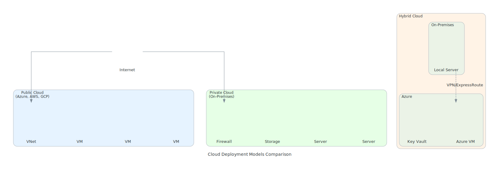
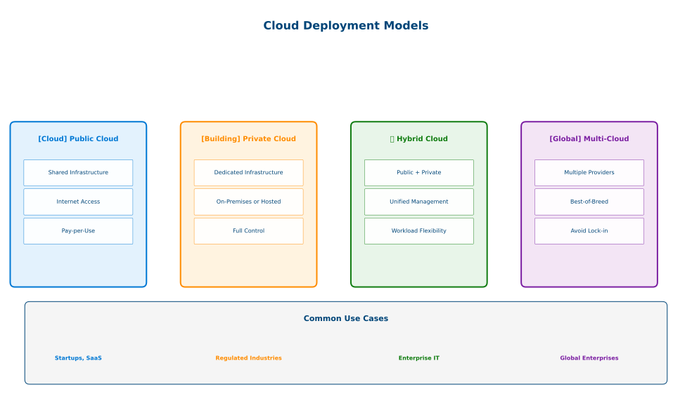

# Cloud Deployment Models

## Table of contents

{: .no_toc .text-delta }

1. TOC
{:toc}

---

## Overview

Cloud deployment models define where cloud infrastructure is located, who has access to it, and how it's managed. Understanding these models is essential for designing solutions that meet sovereignty, security, and compliance requirements.

View Diagram: Cloud Deployment Architectures

_Figure 1: Cloud deployment model architectures and their relationships_

View Diagram: Cloud Deployment Models Overview

_Figure 2: Four primary cloud deployment models and their characteristics_

## Public Cloud

### Definition

Services delivered over the public internet and shared across organizations. Resources owned and operated by third-party providers (Microsoft Azure, AWS, Google Cloud).

### Key Characteristics

- **Multi-tenant architecture** with shared infrastructure
- **Internet-based access** with global availability
- **Provider-managed** infrastructure and operations
- **Pay-per-use** pricing model

### Advantages

- No upfront capital investment
- Virtually unlimited scalability
- 99.9%+ uptime SLAs
- Access to latest technologies

### Challenges

- Limited control over data location
- Compliance complexity for regulated industries
- Internet connectivity dependency

### Ideal Use Cases

Web applications, development/testing, big data analytics, backup/DR, collaboration tools

## Private Cloud

### Definition

Dedicated infrastructure for a single organization, located on-premises or hosted by provider.

### Key Characteristics

- **Single-tenant** with dedicated resources
- **Enhanced security** with isolated environment
- **Customizable** to specific requirements
- **Performance predictability** with no "noisy neighbors"

### Types

**On-Premises:** Organization's data center, full control
**Hosted:** Provider-managed, dedicated hardware
**Virtual Private Cloud (VPC):** Isolated section within public cloud

### Advantages

- Complete security and compliance control
- Predictable performance
- Full customization capabilities

### Challenges

- Higher capital investment
- Limited scalability
- Full management responsibility

### Ideal Use Cases

Regulated industries (healthcare, finance), sensitive data, mission-critical applications

**Examples:** Azure Stack HCI, Azure Local (disconnected), VMware Private Cloud

## Hybrid Cloud

### Definition

Combines public and private clouds, enabling data and application sharing while maintaining distinct boundaries.

### Key Characteristics

- **Multi-environment** integration with unified management
- **Workload portability** between environments
- **Flexible resource allocation** for optimal placement

### Common Patterns

**Cloud Bursting:** Scale to public cloud during peak demand
**Data Locality:** Keep sensitive data on-premises, use cloud for processing
**Disaster Recovery:** Primary on-premises, backup/DR in cloud

### Advantages

- Workload flexibility and gradual migration
- Cost optimization (base in private, burst to public)
- Balance compliance with innovation
- Access to latest cloud services

### Challenges

- Multi-environment complexity
- Network connectivity requirements
- Cross-platform expertise needed

### Ideal Use Cases

Gradual cloud migration, variable workloads, compliance with innovation needs, DR/business continuity

**Technologies:** Azure Arc, Azure Local (connected), AWS Outposts, Google Anthos, VMware Cloud Foundation

## Multi-Cloud

### Definition

Using services from multiple cloud providers simultaneously to avoid vendor lock-in or leverage best-of-breed capabilities.

### Key Characteristics

- **Multiple providers** with diverse technology stacks
- **Best-of-breed** service selection
- **Distributed architecture** across clouds

### Common Strategies

**Diversified Portfolio:** Different apps on different clouds
**Active-Active:** Same apps on multiple clouds for redundancy
**Specialized Services:** Best capabilities from each provider

### Advantages

- Avoid vendor lock-in
- Increased resilience and redundancy
- Optimize service selection per use case

### Challenges

- Management complexity across platforms
- Multi-platform expertise required
- Integration and data transfer complexity
- Multiple billing relationships

### Ideal Use Cases

Vendor independence strategy, global enterprises, high-availability needs, specialized service requirements

## Deployment Model Comparison

| Aspect | Public Cloud | Private Cloud | Hybrid Cloud | Multi-Cloud |
|--------|--------------|---------------|--------------|-------------|
| **Cost** | Low | High | Medium | Variable |
| **Control** | Low | High | Medium | Medium |
| **Scalability** | High | Limited | High | High |
| **Security** | Shared | Dedicated | Mixed | Variable |
| **Compliance** | Standard | Custom | Flexible | Complex |
| **Management** | Simple | Complex | Medium | Complex |

## Decision Framework

### Choosing the Right Model

**Public Cloud:** Cost optimization, standard compliance, rapid scaling, limited IT resources
**Private Cloud:** Data sovereignty, regulated industry, predictable workloads, custom security
**Hybrid Cloud:** Gradual migration, variable workloads, data locality + cloud benefits
**Multi-Cloud:** Vendor independence, best-of-breed services, high availability

### Key Assessment Areas

**Regulatory:** Data residency, compliance frameworks, data sensitivity
**Technical:** Performance needs, workload predictability, integration requirements
**Business:** Risk tolerance, cost priorities, vendor independence
**Organizational:** IT expertise, scaling speed, complexity tolerance

## Real-World Examples

**Financial Services (Hybrid):** Core banking in private cloud, web/analytics in public cloud
**Healthcare (Private + SaaS):** Patient records private, collaboration tools SaaS
**Global Retailer (Multi-Cloud):** AWS for e-commerce, Azure for AI, Google for data warehouse
**Startup (Public):** Single provider, maximize SaaS/PaaS for rapid scaling

## Migration Strategies

**Cloud-Native:** Build new apps in cloud directly
**Lift-and-Shift:** Move existing apps with minimal changes
**Modernization:** Refactor for cloud-native architectures
**Hybrid-First:** Keep critical systems on-premises, gradual migration

## Summary

Cloud deployment models provide different approaches to leveraging cloud benefits while meeting specific requirements:

- **Public Cloud** offers maximum cost efficiency and scalability
- **Private Cloud** provides maximum control and customization
- **Hybrid Cloud** balances control with cloud benefits
- **Multi-Cloud** maximizes choice and reduces vendor dependence

The optimal approach depends on your specific requirements for cost, control, compliance, and complexity tolerance.

## Next Steps

1. ✅ Review deployment model characteristics and trade-offs
2. ✅ Assess which models align with your organization's needs
3. ✅ Continue to [Cloud Benefits and Considerations](cloud-benefits.md)
4. ✅ Complete the [Knowledge Check](cloud-computing-knowledge-check.md) after all Module 1 content

---

## Additional Resources

- [Azure Hybrid and Multi-Cloud](https://azure.microsoft.com/en-us/solutions/hybrid-cloud-app/)
- [AWS Hybrid Cloud](https://aws.amazon.com/hybrid/)
- [Google Cloud Hybrid and Multi-Cloud](https://cloud.google.com/solutions/hybrid-and-multi-cloud)

---

**Last Updated:** November 2025
