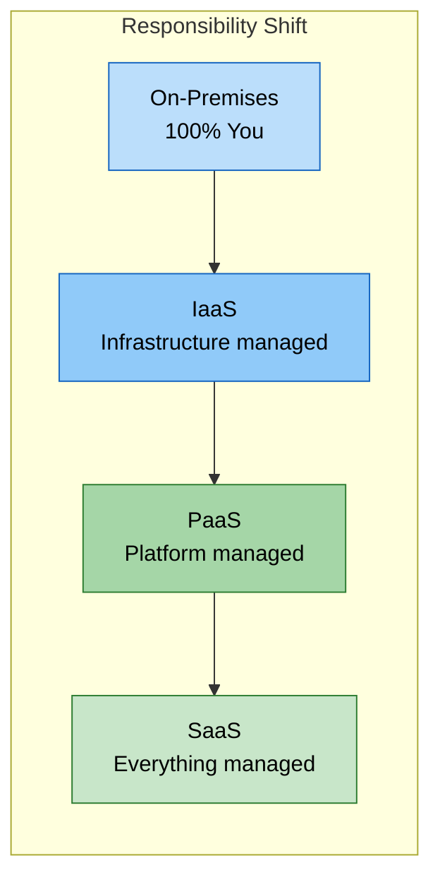

# Cloud Service Models

## Table of contents

{: .no_toc .text-delta }

1. TOC
{:toc}

---

## Overview

Cloud service models define the level of control and responsibility between cloud providers and customers. Understanding these models is crucial for selecting appropriate cloud solutions and understanding shared responsibility boundaries.

## The Three Primary Service Models

### Infrastructure as a Service (IaaS)

**Definition:** Virtualized computing infrastructure (servers, storage, networking) delivered over the internet.

**Provider Manages:** Physical hardware, virtualization layer
**You Manage:** OS, middleware, applications, data, security

**Examples:** Azure Virtual Machines, AWS EC2, Google Compute Engine
**Use Cases:** Web hosting, dev/test, big data, backup/DR

### Platform as a Service (PaaS)

**Definition:** Platform for developing and running applications without infrastructure management complexity.

**Provider Manages:** Infrastructure, OS, development tools, scaling
**You Manage:** Applications, data, configurations

**Examples:** Azure App Service, Azure Functions, Google Cloud Run, Heroku
**Use Cases:** Web apps, APIs, databases, microservices

### Software as a Service (SaaS)

**Definition:** Complete applications delivered over the internet with full provider management.

**Provider Manages:** Everything (infrastructure, platform, application, updates)
**You Manage:** User data, access permissions, configurations

**Examples:** Microsoft 365, Salesforce, ServiceNow, Slack

**Use Cases:**

- Email and collaboration
- Customer relationship management
- Human resources management
- Accounting and finance

## Service Model Comparison

| Aspect | IaaS | PaaS | SaaS |
|--------|------|------|------|
| **Control** | High | Medium | Low |
| **Flexibility** | Maximum | Moderate | Limited |
| **Management Overhead** | High | Medium | Low |
| **Time to Deploy** | Days/Weeks | Hours/Days | Minutes |
| **Scalability Control** | Manual | Automatic | Automatic |
| **Customization** | Full | Moderate | Limited |
| **Cost Predictability** | Variable | Moderate | Predictable |

## Shared Responsibility Model

Understanding who is responsible for what in each service model:

View Diagram: Shared Responsibility Model

| Layer | On-Premises | IaaS | PaaS | SaaS |
|:------|:-----------:|:----:|:----:|:----:|
| **Data** | 🔵 You | 🔵 You | 🔵 You | 🔵 You |
| **Applications** | 🔵 You | 🔵 You | 🔵 You | 🟢 Provider |
| **Runtime** | 🔵 You | 🔵 You | 🟢 Provider | 🟢 Provider |
| **Middleware** | 🔵 You | 🔵 You | 🟢 Provider | 🟢 Provider |
| **Operating System** | 🔵 You | 🔵 You | 🟢 Provider | 🟢 Provider |
| **Virtualization** | 🔵 You | 🟢 Provider | 🟢 Provider | 🟢 Provider |
| **Servers** | 🔵 You | 🟢 Provider | 🟢 Provider | 🟢 Provider |
| **Storage** | 🔵 You | 🟢 Provider | 🟢 Provider | 🟢 Provider |
| **Networking** | 🔵 You | 🟢 Provider | 🟢 Provider | 🟢 Provider |

_🔵 You = Customer Responsibility | 🟢 Provider = Cloud Provider Responsibility_

### IaaS Responsibilities

**Customer Responsible For:**

- Operating system updates and patches
- Application security
- Network configuration
- Access management
- Data encryption
- Backup and recovery

**Provider Responsible For:**

- Physical security
- Hardware maintenance
- Network infrastructure
- Hypervisor security
- Power and cooling

### PaaS Responsibilities

**Customer Responsible For:**

- Application code security
- Data protection
- User access management
- Application configuration
- Identity management

**Provider Responsible For:**

- Operating system maintenance
- Runtime environment security
- Platform scaling
- Infrastructure security
- Network security

### SaaS Responsibilities

**Customer Responsible For:**

- Data classification
- User access management
- Device management
- Account management

**Provider Responsible For:**

- Application security
- Infrastructure security
- Platform maintenance
- Data backup
- Network security

## Choosing the Right Service Model

**Choose IaaS:** Maximum control, specific configurations, specialized requirements, lift-and-shift migrations
**Choose PaaS:** Focus on development, rapid deployment, cloud-native apps, managed services
**Choose SaaS:** Immediate application access, limited IT resources, subscription pricing, collaboration needs

### Cost Comparison

**IaaS:** Lower base costs but higher management overhead
**PaaS:** Higher base costs but lower management overhead
**SaaS:** Per-user pricing, no management overhead

## Hybrid and Multi-Service Approaches

### Combining Service Models

Many organizations use multiple service models simultaneously:

**Example Architecture:**

- **SaaS:** Microsoft 365 for productivity and collaboration
- **PaaS:** Azure App Service for custom web applications
- **IaaS:** Virtual machines for legacy applications

**Benefits:**

- Optimize each workload for appropriate service model
- Gradual cloud migration strategy
- Balance control and convenience

### Real-World Example

Organizations often combine all three models:
**SaaS:** Microsoft 365 for collaboration
**PaaS:** Azure App Service for custom apps
**IaaS:** VMs for legacy applications

## Cloud Migration Journey

**Phase 1 (IaaS):** Lift-and-shift existing applications
**Phase 2 (PaaS):** Modernize with cloud-native services
**Phase 3 (SaaS + PaaS):** Adopt SaaS where possible, build differentiators on PaaS

## Common Pitfalls & Best Practices

**IaaS:** Avoid under-estimating management; use infrastructure as code, monitoring, auto-scaling
**PaaS:** Plan for portability; implement logging, API-first design, understand service limits
**SaaS:** Establish data governance; invest in training, plan integrations early

## Summary

Understanding cloud service models is fundamental to making informed decisions about cloud adoption:

- **IaaS** provides maximum control and flexibility with higher management overhead
- **PaaS** balances control and convenience, enabling rapid application development
- **SaaS** offers immediate value with minimal management requirements

Most organizations benefit from a multi-model approach, selecting the appropriate service model for each workload based on requirements, constraints, and strategic objectives.

## Next Steps

1. ✅ Review service model characteristics and use cases
2. ✅ Consider which models apply to your organization's needs
3. ✅ Continue to [Cloud Deployment Models](cloud-deployment-models.md)
4. ✅ Complete the [Knowledge Check](cloud-computing-knowledge-check.md)

---

## Additional Resources

- [Azure Service Models Overview](https://learn.microsoft.com/en-us/azure/cloud-adoption-framework/ready/considerations/fundamental-concepts)
- [AWS Service Models Explained](https://aws.amazon.com/types-of-cloud-computing/)
- [Google Cloud Service Models](https://cloud.google.com/docs/overview/cloud-platform-services)

---

**Last Updated:** November 2025
