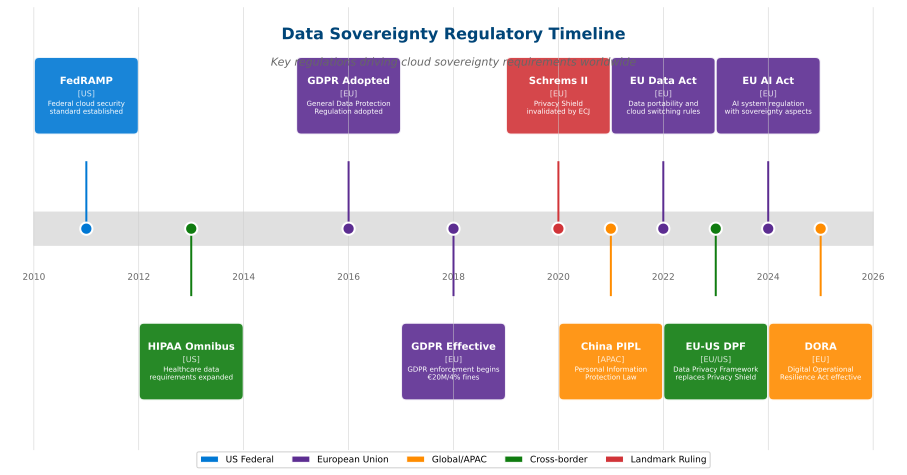

# Compliance Frameworks

## Overview

Compliance frameworks provide structured approaches to meeting regulatory and industry requirements for data protection, security, and governance.

View Diagram: Major Compliance Framework Timeline

_Figure: Timeline of major compliance and data protection regulations_

## Major Global Frameworks

### GDPR (General Data Protection Regulation)

- **Scope**: EU personal data protection
- **Key Requirements**: Consent, data portability, right to be forgotten
- **Penalties**: Up to 4% of annual revenue

### SOC 2 (Service Organization Control 2)

- **Scope**: Service providers handling customer data
- **Principles**: Security, availability, processing integrity, confidentiality, privacy
- **Audit**: Annual independent assessment

### ISO 27001

- **Scope**: Information security management systems
- **Approach**: Risk-based security management
- **Certification**: Global standard recognition

## Industry-Specific Frameworks

### Healthcare

- **HIPAA**: US healthcare data protection
- **HITECH**: Enhanced HIPAA enforcement
- **Medical Device Regulation (MDR)**: EU medical device compliance

### Financial Services

- **PCI DSS**: Payment card data security
- **SOX**: Financial reporting controls
- **Basel III**: Banking risk management

### Government

- **FedRAMP**: US federal cloud security
- **FISMA**: Federal information system security
- **ITAR**: Defense-related data controls

## Cloud Compliance Considerations

### Shared Responsibility

- Provider handles infrastructure compliance
- Customer responsible for data and application compliance
- Clear documentation of responsibility boundaries

### Compliance Inheritance

- Leverage provider certifications
- Understand scope and limitations
- Maintain customer-specific requirements

## Next Steps

Review [Identity and Access Basics](identity-access-basics.md) for access control fundamentals.

---

**Last Updated:** November 2025
