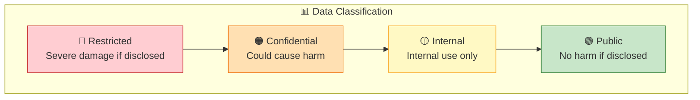

# Data Protection Principles

## Overview

Understanding how to properly classify, handle, and protect data is fundamental to cloud security and compliance.

View Diagram: Data Classification Pyramid

## Data Classification Framework

### Classification Levels

- **Public**: No harm if disclosed (marketing materials)
- **Internal**: For internal use only (policies, procedures)
- **Confidential**: Could cause harm if disclosed (financial data)
- **Restricted**: Severe damage if disclosed (personal data, secrets)

### Data Handling Requirements

Each classification level requires specific handling procedures, access controls, and protection measures.

## Data Protection Methods

### Encryption

- **At Rest**: Protects stored data
- **In Transit**: Protects data during transmission
- **In Use**: Protects data during processing

### Access Controls

- Role-based access control (RBAC)
- Attribute-based access control (ABAC)
- Just-in-time access for privileged operations

### Data Loss Prevention (DLP)

- Monitor data movement
- Prevent unauthorized disclosure
- Alert on policy violations

## Privacy Principles

### Data Minimization

Collect and process only necessary data for specific purposes.

### Purpose Limitation

Use data only for stated, legitimate purposes.

### Storage Limitation

Retain data only as long as necessary.

## Next Steps

Continue to [Compliance Frameworks](compliance-frameworks.md) to understand regulatory requirements.

---

**Last Updated:** November 2025
