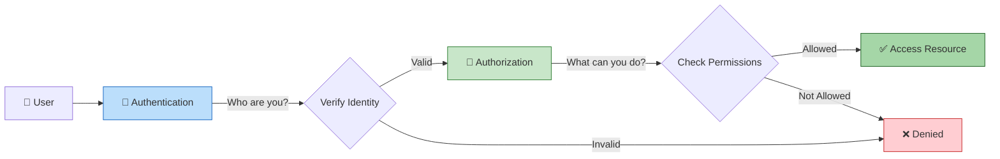

# Identity and Access Basics

## Overview

Identity and Access Management (IAM) is the foundation of cloud security, controlling who can access what resources and under what conditions.

View Diagram: Authentication vs Authorization Flow

## Core Concepts

### Authentication vs Authorization

- **Authentication**: Verifying identity ("Who are you?")
- **Authorization**: Determining permissions ("What can you do?")

### Identity Types

- **Human Identities**: Users, administrators, developers
- **Service Identities**: Applications, services, APIs
- **Device Identities**: Computers, mobile devices, IoT devices

## Authentication Methods

### Single-Factor Authentication

- Passwords, PINs, security questions
- Vulnerable to compromise
- Not recommended for sensitive systems

### Multi-Factor Authentication (MFA)

- **Knowledge**: Something you know (password)
- **Possession**: Something you have (phone, token)
- **Inherence**: Something you are (biometrics)

### Modern Authentication

- OAuth 2.0 and OpenID Connect protocols
- Token-based authentication
- Single sign-on (SSO) capabilities

## Access Control Models

### Role-Based Access Control (RBAC)

- Permissions assigned to roles
- Users assigned to roles
- Simplifies permission management

### Attribute-Based Access Control (ABAC)

- Dynamic permissions based on attributes
- Context-aware access decisions
- Fine-grained control capabilities

### Just-in-Time (JIT) Access

- Temporary elevated permissions
- Time-bound access grants
- Reduces standing privileges

## Identity Governance

### Access Reviews

- Regular review of user permissions
- Removal of unused access
- Compliance with least privilege

### Lifecycle Management

- User onboarding and offboarding
- Role changes and transitions
- Automated provisioning and deprovisioning

## Cloud Identity Considerations

### Federation

- Trust relationships between identity providers
- Single sign-on across multiple systems
- Centralized identity management

### Zero Trust Architecture

- Never trust, always verify
- Continuous authentication and authorization
- Assume breach mentality

## Next Steps

Complete the [Security & Compliance Knowledge Check](security-compliance-knowledge-check.md) to test your understanding.

---

**Last Updated:** November 2025
