# Security & Compliance Basics

## Table of contents

{: .no_toc .text-delta }

1. TOC
{:toc}

---

## Overview

Security and compliance are fundamental considerations in cloud computing. Understanding basic security principles and compliance frameworks is essential for making informed decisions about cloud adoption and ensuring appropriate protection of organizational assets and data.

## Core Security Principles

```mermaid
graph TD
    subgraph CIA["🔐 CIA Triad"]
        C[("🔒 Confidentiality")]
        I[("✅ Integrity")]
        A[("⚡ Availability")]
    end

    C --- I
    I --- A
    A --- C

    C --> C1["Access Controls"]
    C --> C2["Encryption"]
    C --> C3["Authentication"]

    I --> I1["Checksums"]
    I --> I2["Digital Signatures"]
    I --> I3["Version Control"]

    A --> A1["Redundancy"]
    A --> A2["Backups"]
    A --> A3["Disaster Recovery"]

    style C fill:#e3f2fd,stroke:#1565c0,color:#0d47a1
    style I fill:#e8f5e9,stroke:#2e7d32,color:#1b5e20
    style A fill:#fff3e0,stroke:#ef6c00,color:#e65100
    style CIA fill:#fafafa,stroke:#424242
```

View Diagram: The CIA Triad

### The CIA Triad

The foundation of information security rests on three core principles:

**Confidentiality**

- Ensures information is accessible only to authorized individuals
- Protects sensitive data from unauthorized disclosure
- Implemented through access controls, encryption, and authentication

**Integrity**

- Ensures information remains accurate, complete, and unaltered
- Protects against unauthorized modification or destruction
- Implemented through checksums, digital signatures, and version control

**Availability**

- Ensures information and systems are accessible when needed
- Protects against disruption of service or access
- Implemented through redundancy, backup systems, and disaster recovery

### Defense in Depth

```mermaid
graph TB
    subgraph Layers["🛡️ Defense in Depth"]
        L1["🏢 Physical Security"]
        L2["🌐 Network Security"]
        L3["💻 Endpoint Security"]
        L4["📱 Application Security"]
        L5["💾 Data Security"]
        L6["👤 Identity Security"]
        L7["📋 Administrative Controls"]
    end

    L1 --> L2 --> L3 --> L4 --> L5 --> L6 --> L7

    L1 -.-> P1["Data centers, locks, guards"]
    L2 -.-> P2["Firewalls, VPNs, segmentation"]
    L3 -.-> P3["Antivirus, patching, encryption"]
    L4 -.-> P4["WAF, input validation, SAST"]
    L5 -.-> P5["Encryption, DLP, classification"]
    L6 -.-> P6["MFA, RBAC, SSO"]
    L7 -.-> P7["Policies, training, audits"]

    style Layers fill:#e8eaf6,stroke:#3f51b5
    style L1 fill:#ffcdd2,stroke:#c62828
    style L2 fill:#ffe0b2,stroke:#ef6c00
    style L3 fill:#fff9c4,stroke:#f9a825
    style L4 fill:#c8e6c9,stroke:#2e7d32
    style L5 fill:#b3e5fc,stroke:#0277bd
    style L6 fill:#e1bee7,stroke:#7b1fa2
    style L7 fill:#d7ccc8,stroke:#5d4037
```

View Diagram: Defense in Depth Layers

Multiple layers of security controls (physical, network, endpoint, application, data, identity, administrative) provide comprehensive protection.

### Principle of Least Privilege

Users receive only minimum permissions necessary for their role. Regular review and time-bound access reduce risk.

### Zero Trust Security Model

Never trust, always verify. Continuous verification of identity and device state with conditional access based on risk.

## Identity and Access Management (IAM)

### Authentication vs. Authorization

**Authentication (Who are you?):** Verifies identity through passwords, MFA, biometrics
**Authorization (What can you do?):** Determines access permissions based on roles and policies

### Multi-Factor Authentication (MFA)

Combines multiple verification factors:

- **Knowledge:** Passwords, PINs
- **Possession:** Mobile phones, hardware tokens
- **Inherence:** Biometrics (fingerprint, facial recognition)

### Role-Based Access Control (RBAC)

Users assigned to roles based on job responsibilities. Roles have predefined permissions, simplifying management and compliance.

## Data Protection Fundamentals

### Data Classification

**Public:** No harm if disclosed
**Internal:** Internal use only, basic controls
**Confidential:** Could cause harm, enhanced protection
**Restricted:** Severe damage potential, highest protection

### Data Encryption

**In Transit:** Protects data moving between systems (TLS/SSL, IPsec)
**At Rest:** Protects stored data (files, databases, backups)
**Key Management:** Secure key generation, storage, rotation; HSMs for high-value keys

### Data Loss Prevention (DLP)

Monitors data movement, identifies sensitive patterns, blocks/alerts on policy violations

## Network Security Basics

### Core Controls

**Firewalls:** Control traffic based on security rules, first line of defense
**VPNs:** Encrypted tunnels for secure remote access
**Network Segmentation:** Isolate resources to limit breach impact

## Common Security Threats

**Malware:** Viruses, ransomware; mitigate with antivirus, patching, training
**Phishing:** Fraudulent communications; mitigate with training, filtering, MFA
**Social Engineering:** Psychological manipulation; mitigate with awareness training
**Insider Threats:** Internal risks; mitigate with access controls, monitoring

### Cloud-Specific Considerations

**Shared Responsibility:** Provider secures infrastructure, customer secures data/apps
**Data Location:** Understand storage locations and residency requirements
**Account Management:** Secure cloud accounts and integrate with identity systems

## Compliance Frameworks Overview

### What is Compliance?

Meeting legal, regulatory, and industry requirements; following standards; demonstrating due diligence.

View Diagram: Compliance Frameworks Comparison

_Figure 1: Major compliance frameworks and their key focus areas_

### Major Frameworks

**SOC 2:** Service provider security, availability, confidentiality, privacy
**ISO 27001:** International information security management standard
**GDPR:** EU data protection and privacy regulation
**HIPAA:** US healthcare data protection (PHI)
**PCI DSS:** Credit card data security requirements

### Cloud Compliance

**Shared Responsibility:** Providers achieve certifications, customers ensure compliant use
**Benefits:** Professional controls, third-party audits, automated monitoring, cost-effective access

## Risk Management Principles

### Risk Process

**Identification:** Identify threats, vulnerabilities, and asset value
**Analysis:** Assess impact and probability, prioritize by severity
**Treatment:** Accept, avoid, mitigate, or transfer risks

### Business Continuity

**Impact Analysis:** Define RTO/RPO for critical processes
**Disaster Recovery:** Backup procedures, alternative sites, regular testing
**High Availability:** Redundancy, failover, geographic distribution

## Security Governance

**Policies:** High-level management intent, acceptable use, accountability
**Procedures:** Detailed implementation guidelines and standards
**Training:** Regular awareness training, phishing simulations, role-specific training
**Continuous Improvement:** Regular assessments, lessons learned, threat updates

## Cloud Security Best Practices

**Account Security:** MFA enabled, regular password updates, access reviews, admin/user separation
**Data Protection:** Encryption at rest and in transit, key management, automated backups, recovery testing
**Monitoring:** Continuous security monitoring, automated alerts, log analysis, regular assessments
**Incident Response:** Defined procedures, clear roles, communication plans, post-incident reviews

## Industry-Specific Considerations

**Healthcare:** HIPAA compliance (administrative, physical, technical safeguards)
**Financial:** SOX, PCI DSS, GLBA, Basel III requirements
**Government:** FedRAMP, FISMA, ITAR compliance

## Summary

Security and compliance are foundational to successful cloud adoption. Key principles include:

- **CIA Triad**: Confidentiality, Integrity, Availability
- **Defense in Depth**: Multiple layers of security controls
- **Identity and Access Management**: Authentication and authorization
- **Data Protection**: Classification, encryption, and loss prevention
- **Compliance Frameworks**: Understanding regulatory requirements
- **Risk Management**: Assessment, treatment, and continuous monitoring

Understanding these basics prepares you for more advanced security topics and helps ensure appropriate protection in cloud environments.

## Next Steps

1. ✅ Review security principles and their applications
2. ✅ Consider how these concepts apply to your organization
3. ✅ Continue to [Data Protection Principles](data-protection-principles.md)
4. ✅ Study [Compliance Frameworks](compliance-frameworks.md)
5. ✅ Review [Identity and Access Basics](identity-access-basics.md)
6. ✅ Complete [Module 2 Knowledge Check](security-compliance-knowledge-check.md)

---

## Additional Resources

- [NIST Cybersecurity Framework](https://www.nist.gov/cyberframework)
- [Cloud Security Alliance (CSA)](https://cloudsecurityalliance.org/)
- [Microsoft Security Documentation](https://learn.microsoft.com/en-us/security/)
- [AWS Security Best Practices](https://aws.amazon.com/security/security-resources/)

---

**Last Updated:** November 2025
